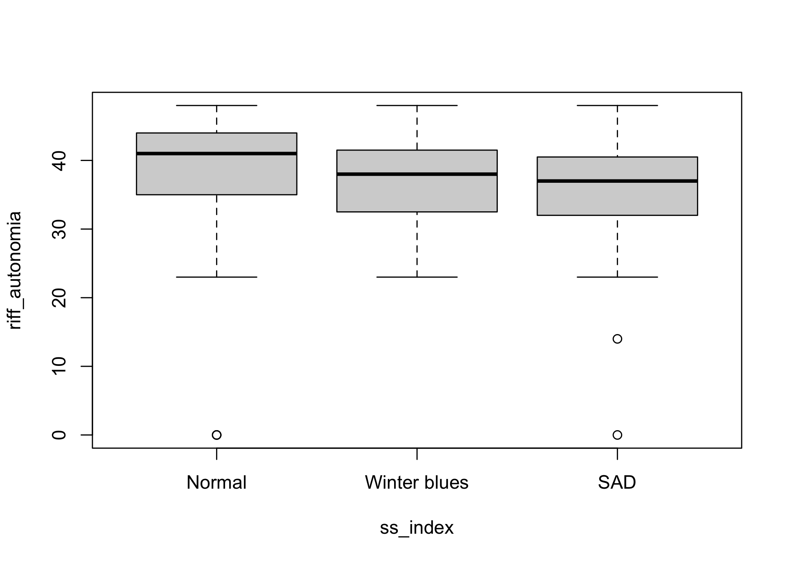

<!-- README.md is generated from README.Rmd. Please edit that file -->

# seasonalSensitivity

<!-- badges: start -->

[](https://lifecycle.r-lib.org/articles/stages.html#experimental)
[](https://CRAN.R-project.org/package=seasonalSensitivity)
[](https://github.com/nim-ach/seasonalSensitivity/actions/workflows/R-CMD-check.yaml)
<!-- badges: end -->

Este paquete de `R` contiene herramientas complementarias para la
exploración y la reproducibilidad de los análisis llevados a cabo para
el estudio de sensibilidad estacional. Este estudio es llevado a cabo
por Cristian Núñez Espinosa, Matías Castillo Aguilar y Claudia Estrada
Goic.

## Sobre <i class="fab fa-r-project"></i>

`R` es un lenguaje de programación estadística de alto nivel usado para
el análisis de datos, así como para el desarrollo de herramientas
informáticas como sitios web, reportes, aplicaciones, libros digitales,
etc. Para más información puedes visitar el sitio de
[R-project](https://www.r-project.org/about.html).

## Instalación

Puedes instalar la versión de desarrollo de seasonalSensitivity desde
[GitHub](https://github.com/) escribiendo lo siguiente en tu consola de
`R`:

``` r
# install.packages("devtools")
devtools::install_github("nim-ach/seasonalSensitivity")
```

## Ejemplo de uso

Para usar los datos basta con cargar la librería una vez instalada.
Puedes hacerlo de la siguiente forma

``` r
library(seasonalSensitivity) # Cargamos el paquete

exists("dataset") # Tenemos listos nuestros datos para ser usados
#> [1] TRUE
```

Como demostración grafiquemos la autonomía como dominio de bienestar de
Ryff según la clasificación basado en el puntaje de sensibilidad
estacional (i.e., Seasonal Score Index):

``` r
with(dataset, plot(riff_autonomia ~ ss_index))
```



Y como dato adicional podriamos calcular la mediana y el rango
intercuartil de `riff_autonomia` para para categoría de `ss_index` de la
siguiente forma:

``` r
# Creamos una función para estimar los estadísticos
median_iqr <- function(x) {
  x <- x[!is.na(x)] # Paso 1: eliminamos los valores perdidos
  mu <- median(x)   # Paso 2: calculamos la mediana
  sigma <- IQR(x)   # Paso 3: calculamos el rango intercuartílico
  paste0(round(mu, 1), " (", round(sigma, 1), ")")
}

# La implementamos usando syntaxis data.table: DT[i, j, by]
dataset[, .("median (IQR)" = median_iqr(riff_autonomia)), ss_index]
#>        ss_index median (IQR)
#>          <fctr>       <char>
#> 1:       Normal       41 (9)
#> 2:          SAD     37 (8.2)
#> 3: Winter blues       38 (9)
#> 4:         <NA>       41 (0)
```
